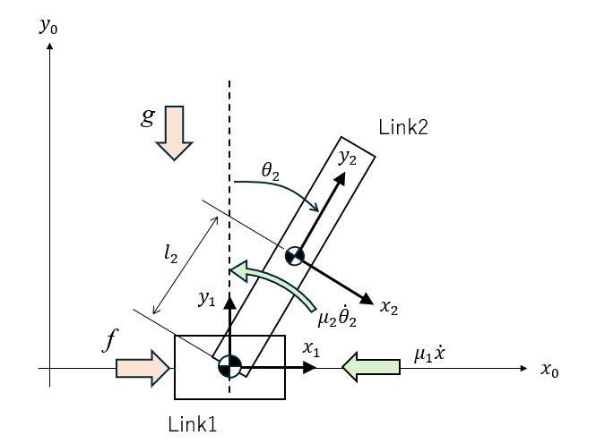

# 2D Cart Poleのモデリング

1. [Newton-Euler法](./notes/cartpole_2d_newton_euler.ipynb)
2. [Lagrange法](./notes/cartpole_2d_lagrange.ipynb)
3. [Kane法](./notes/cartpole_2d_kane.ipynb)

参考文献
1. 倒立倒子で学ぶ制御工学、川田他、森北出版
